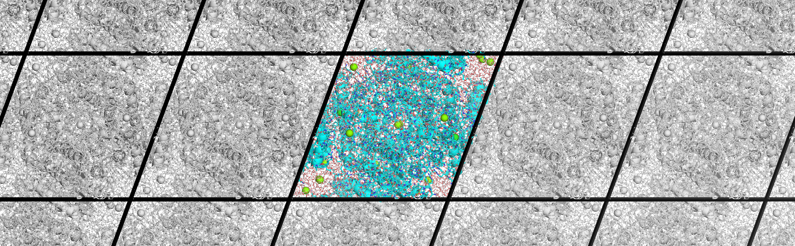

# RCFE analysis tools

This repository contains the three command-line tools used for the relative
crystallization free-energy study:

- `sltcap-plus` calculates salt-ion counts for a target concentration.
- `fast-pcc-rmsd` calculates pairwise crystal-contact RMSDs (`fpcc`).
- `maximin-pc` selects separated solvent-channel positions for co-alchemical
  particles.

The tools remain independent Python packages. Install one or more packages
from the repository with, for example:

```bash
python3 -m pip install ./packages/sltcap-plus
python3 -m pip install ./packages/fast-pcc-rmsd
python3 -m pip install ./packages/maximin-pc
```

Run each package's tests from its directory with `python3 -m pytest`.

All packages are released under the MIT License. The `fast-pcc-rmsd` package
also offers optional CUDA extras documented in its package README.

This publication release combines the source snapshots of `sltcap-plus`
(`29c2139`), `fast-pcc-rmsd` (`c02a569`), and `maximin-pc` (`7e68af6`).
